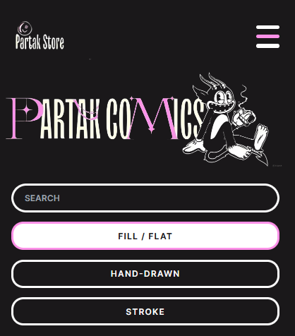
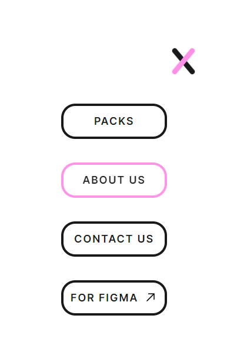
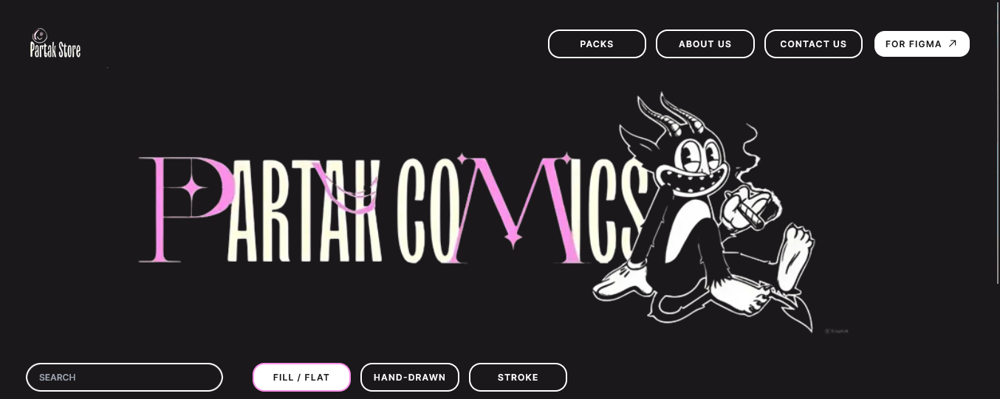
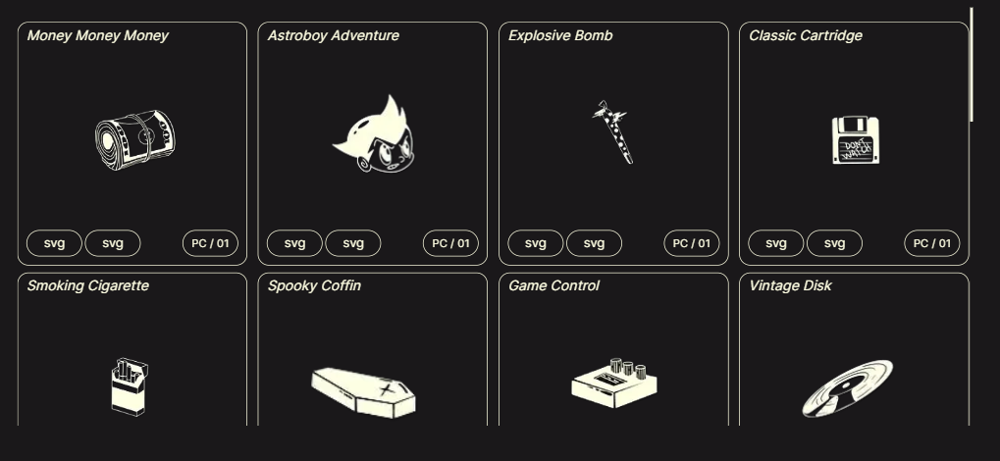

# Partak Comics

<div style="display: grid;
grid-template-columns: 1fr 1fr; gap: 10px; padding: 10px;">
    
    
    
    
</div>

Partak Comics é uma aplicação web construída com Next.js que permite aos usuários explorar e visualizar uma coleção de quadrinhos. Este projeto é um exemplo de como usar Next.js para criar uma aplicação web moderna e responsiva.


### Tecnologias Utilizadas Frontend:

- Next.js
- Tailwind CSS
- React Icons

**Backend (ainda em desenvolvimento):**

- NestJs
- Typescript
- PostgreSQL

**Como testar localmente?**

#### Instruções para Desenvolvedores:

Clone o repositório:
```bash
git clone https://github.com/marcoDmc/Partak-Comics.git
```

#### Instale as dependências do frontend:

```bash
cd Partak-Comics
npm install
```
#### Execute o servidor de desenvolvimento:

```bash
npm run dev
```

## Deploy

Este projeto está atualmente implantado na Vercel. Você pode acessá-lo aqui:

[Partak-Comics](https://upload-file-rho.vercel.app/)

#### Contato

Para qualquer dúvida, sugestão ou problema relacionado a este projeto, sinta-se à vontade para entrar em contato:

meu email: [email](mailto:marcodamasceno0101@outlook.com)
GitHub Issues: [GitHub Issues](https://github.com/marcoDmc/Partak-Comics/issues)
Agradeço o seu interesse em contribuir para tornar este projeto ainda melhor!


Este texto foi revisado para corrigir erros de pontuação e organizado para melhor clareza e legibilidade no contexto de um documento Markdown.

